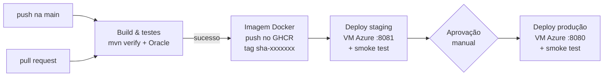
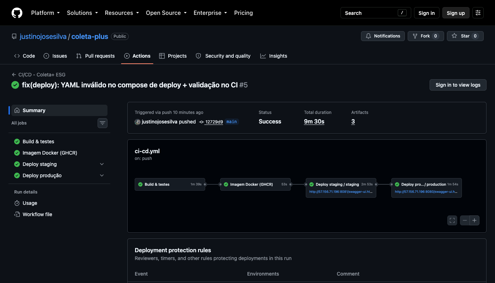
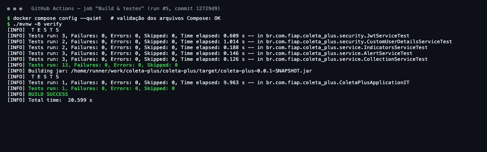
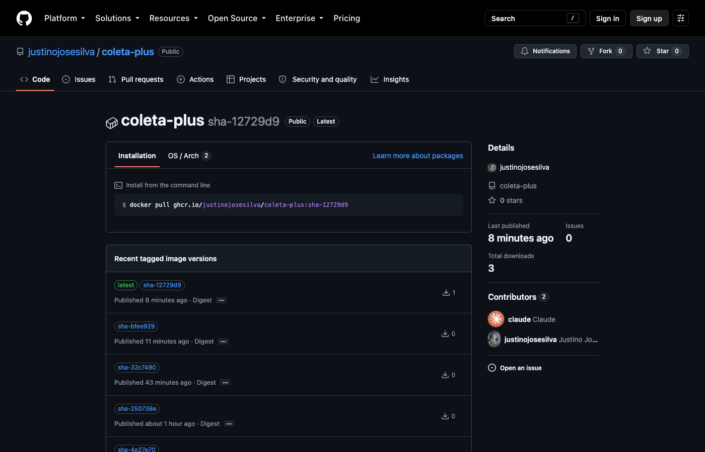
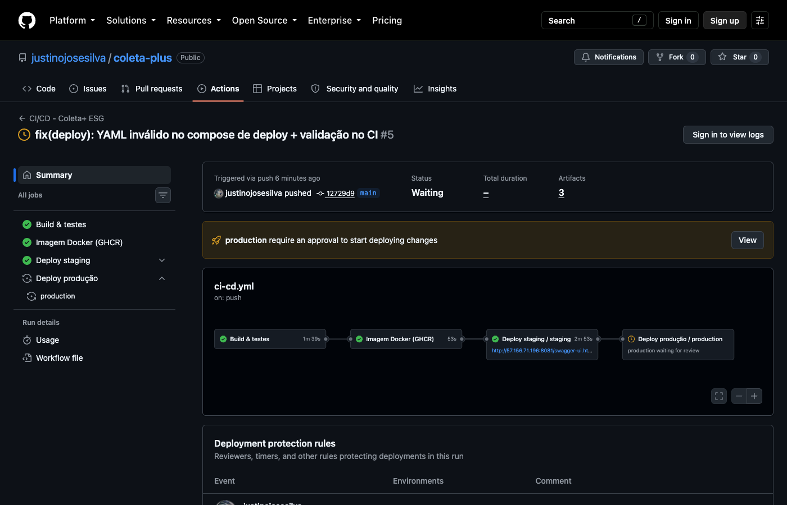
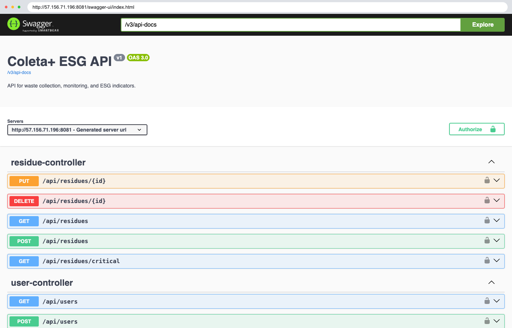
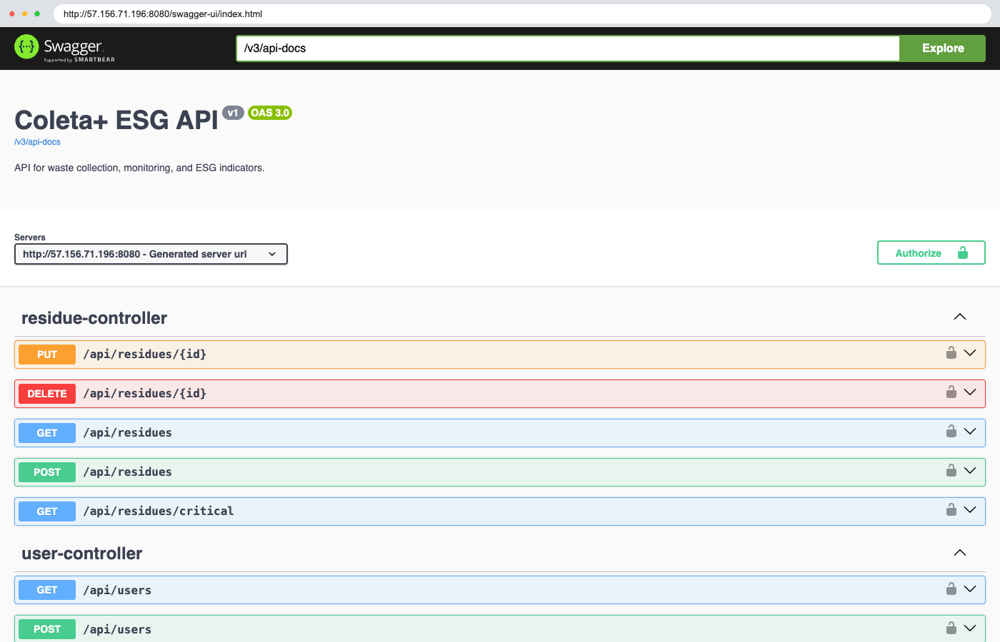
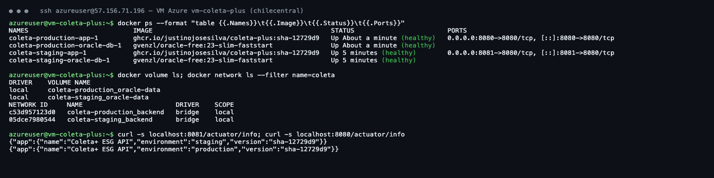
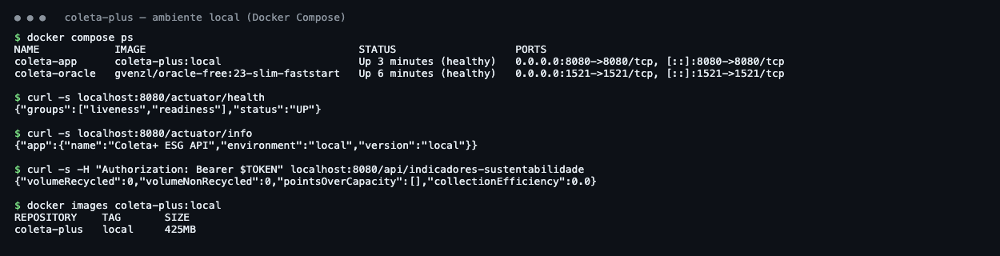

# Projeto - Cidades ESGInteligentes

**Coleta+ ESG API**: API REST para gestão de resíduos em pontos de coleta urbanos, com geração automática de alertas de capacidade e indicadores ESG (volume reciclado × não reciclado, pontos acima da capacidade e eficiência de coleta).

Projeto da Fase 6 (*Navegando pelo mundo DevOps*) da FIAP: a aplicação Java Spring das fases anteriores ganhou pipeline CI/CD completo, containerização e deploy automatizado em **staging** e **produção**.

| | |
|---|---|
| Repositório | <https://github.com/justinojosesilva/coleta-plus> |
| Pipeline | <https://github.com/justinojosesilva/coleta-plus/actions> |
| Imagem Docker | `ghcr.io/justinojosesilva/coleta-plus` |
| Staging | <http://57.156.71.196:8081/swagger-ui.html> |
| Produção | <http://57.156.71.196:8080/swagger-ui.html> |
| Integrante | [Seu nome - RM] |

---

## Como executar localmente com Docker

Pré-requisito: Docker Desktop (ou Docker Engine + Compose v2).

```bash
# 1. Clonar o projeto
git clone https://github.com/justinojosesilva/coleta-plus.git
cd coleta-plus

# 2. Criar o arquivo de variáveis a partir do exemplo (e ajustar as senhas)
cp .env.example .env

# 3. Compilar a imagem e subir app + banco Oracle
docker compose up -d --build

# 4. Acompanhar até os dois containers ficarem "healthy" (~1 min na 1ª vez)
docker compose ps
```

A API sobe em <http://localhost:8080> e o Flyway aplica as migrations V001–V008 automaticamente, incluindo os usuários de exemplo:

| E-mail | Senha | Papel |
|---|---|---|
| admin@coletaplus.local | `admin123` | ADMIN |
| operador@coletaplus.local | `operador123` | USER |
| auditor@coletaplus.local | `auditor123` | AUDIT |

Testando:

```bash
curl http://localhost:8080/actuator/health          # {"status":"UP"}

TOKEN=$(curl -s -X POST http://localhost:8080/api/auth/login \
  -H 'Content-Type: application/json' \
  -d '{"email":"admin@coletaplus.local","password":"admin123"}' | jq -r .token)

curl -H "Authorization: Bearer $TOKEN" http://localhost:8080/api/indicadores-sustentabilidade
```

- Swagger UI: <http://localhost:8080/swagger-ui.html> (clique em **Authorize** e cole o token)
- Parar: `docker compose down` · Parar e apagar o banco: `docker compose down -v`

Rodando os testes sem Docker (Java 21):

```bash
./mvnw test      # testes unitários (não precisam de banco)
./mvnw verify    # unitários + integração (precisa do Oracle do compose rodando)
```

---

## Pipeline CI/CD

**Ferramenta:** GitHub Actions ([`.github/workflows/ci-cd.yml`](.github/workflows/ci-cd.yml) + workflow reutilizável [`deploy.yml`](.github/workflows/deploy.yml)).
**Registry:** GitHub Container Registry (GHCR).
**Infraestrutura:** VM Linux no Microsoft Azure (Ubuntu 24.04, Standard_B2as_v2) com Docker, que hospeda os dois ambientes isolados.



| # | Job | O que faz |
|---|---|---|
| 1 | **Build & testes** | Compila com Java 21 (cache Maven) e executa `mvn verify`: **13 testes unitários** (services, JWT, autorização) e **1 teste de integração** que sobe a aplicação inteira contra um **Oracle real** (*service container*) e valida, com `ddl-auto=validate`, que todas as entidades JPA batem com o schema criado pelo Flyway. Publica relatórios de teste e o `.jar` como artefatos. Roda também em pull requests. |
| 2 | **Imagem Docker** | Build multi-stage com Buildx (cache do GitHub Actions) e push para o GHCR com duas tags: `sha-<commit>` (imutável, usada no deploy) e `latest`. |
| 3 | **Deploy staging** | Conecta na VM via SSH, gera o arquivo `staging.env` a partir dos *secrets* do environment `staging`, copia o compose de deploy e executa [`deploy/deploy.sh`](deploy/deploy.sh), que faz `pull` + `up -d` e espera o container ficar *healthy*. Depois roda um **smoke test** externo: `/actuator/health`, `/actuator/info` (confere ambiente e versão) e login + consulta aos indicadores ESG. |
| 4 | **Deploy produção** | Mesmo processo, com a **mesma imagem já validada em staging**, mas protegido por **aprovação manual** (*required reviewers* no environment `production`, que só aceita a branch `main`). |

**Lógica e boas práticas adotadas**

- *Build once, deploy many*: a imagem é gerada uma única vez; staging e produção recebem exatamente o mesmo artefato (tag `sha-<commit>`), o que garante que o que foi testado é o que vai para produção.
- *Fail fast*: se qualquer teste falha, nenhum deploy acontece; se o smoke test de staging falha, produção não é liberada.
- Segredos (senhas do banco, segredo JWT, chave SSH) ficam em **GitHub Secrets** por ambiente; nada sensível é versionado.
- `concurrency` evita dois deploys simultâneos no mesmo ref.
- Os jobs de deploy só executam quando a variável `VM_HOST` está configurada.

**Configuração dos ambientes** (feita uma única vez):

1. Criar a VM: `az login` e depois `./infra/create-azure-vm.sh` (usa [`infra/cloud-init.yml`](infra/cloud-init.yml) para instalar Docker e criar swap; abre as portas 8080 e 8081).
2. No GitHub, em *Settings → Secrets and variables → Actions*:
   - **Variables:** `VM_HOST` (IP público da VM), `VM_USER` (`azureuser`)
   - **Secret:** `VM_SSH_KEY` (chave privada gerada pelo script)
3. Em *Settings → Environments*, em `staging` e em `production`, cadastrar os secrets `DB_PASSWORD`, `ORACLE_PASSWORD` e `JWT_SECRET` (valores diferentes por ambiente).
4. Rodar o pipeline (*Actions → CI/CD → Run workflow*) e aprovar o deploy de produção.

---

## Containerização

### Dockerfile

```dockerfile
# ---------- Estágio 1: build ----------
FROM maven:3.9-eclipse-temurin-21 AS build
WORKDIR /workspace
COPY pom.xml mvnw ./
COPY .mvn .mvn
RUN ./mvnw -B -q dependency:go-offline
COPY src src
RUN ./mvnw -B -q -DskipTests package \
    && cp target/coleta-plus-*.jar app.jar

# ---------- Estágio 2: runtime ----------
FROM eclipse-temurin:21-jre
ARG APP_VERSION=dev
LABEL org.opencontainers.image.title="coleta-plus" \
      org.opencontainers.image.description="Coleta+ ESG API - Cidades ESG Inteligentes" \
      org.opencontainers.image.version="${APP_VERSION}"
RUN groupadd --system app && useradd --system --gid app --home /app app
WORKDIR /app
COPY --from=build --chown=app:app /workspace/app.jar app.jar
USER app
ENV APP_VERSION=${APP_VERSION} \
    JAVA_OPTS="-XX:MaxRAMPercentage=75 -XX:+ExitOnOutOfMemoryError"
EXPOSE 8080
HEALTHCHECK --interval=15s --timeout=5s --start-period=90s --retries=5 \
    CMD curl -fs http://localhost:8080/actuator/health || exit 1
ENTRYPOINT ["sh", "-c", "exec java $JAVA_OPTS -jar /app/app.jar"]
```

### Estratégias adotadas

| Estratégia | Por quê |
|---|---|
| **Multi-stage build** | O JDK e o Maven só existem no estágio de build; a imagem final tem apenas o JRE e o `.jar` (~425 MB contra ~900 MB). |
| **Cache de dependências** | `pom.xml` é copiado antes do código: alterar só o código não baixa as dependências de novo. |
| **Usuário não-root** | O processo roda como `app`, reduzindo o impacto de uma eventual invasão. |
| **HEALTHCHECK** | Usa o Spring Boot Actuator (`/actuator/health`, que inclui o banco). O Docker, o `deploy.sh` e o pipeline usam esse status. |
| **JVM ciente de container** | `MaxRAMPercentage=75` dimensiona o heap pelo limite de memória do container. |
| **Configuração por variáveis de ambiente** | A mesma imagem roda em local, staging e produção; muda só o `.env`. |
| **`.dockerignore`** | Evita mandar `target/`, `.git/`, `.env` etc. para o contexto de build. |

### Orquestração (Docker Compose)

| Arquivo | Uso |
|---|---|
| [`docker-compose.yml`](docker-compose.yml) | Ambiente **local**: compila a imagem a partir do código. |
| [`deploy/docker-compose.deploy.yml`](deploy/docker-compose.deploy.yml) | **Staging e produção**: usa a imagem publicada no GHCR. Cada ambiente é um projeto Compose separado (`coleta-staging` / `coleta-production`), com rede, volume e banco próprios. |

Os dois arquivos usam:

- **Serviços:** `oracle-db` (Oracle Database 23 Free) e `app` (API Spring Boot).
- **Rede:** `backend` (bridge); a API acessa o banco pelo nome `oracle-db`. Em staging/produção o banco **não publica porta** e só é acessível pela rede interna.
- **Volume:** `oracle-data` persiste os dados do banco entre reinícios e deploys.
- **Variáveis de ambiente:** credenciais, segredo JWT, porta, nome do ambiente e versão (veja [`.env.example`](.env.example), [`deploy/staging.env.example`](deploy/staging.env.example) e [`deploy/production.env.example`](deploy/production.env.example)).
- **Healthchecks + `depends_on: service_healthy`:** a API só sobe quando o banco está pronto.
- **`restart: unless-stopped`** e limite de memória para a API.

---

## Prints do funcionamento

As evidências ficam em [`docs/prints/`](docs/prints/).

| Evidência | Print |
|---|---|
| Pipeline completo (build → imagem → staging → produção) |  |
| Job de build e testes |  |
| Imagem publicada no GHCR |  |
| Aprovação do deploy em produção |  |
| Staging funcionando (`:8081`) |  |
| Produção funcionando (`:8080`) |  |
| Containers rodando na VM |  |
| Ambiente local com Docker Compose |  |

Links: [execuções do pipeline](https://github.com/justinojosesilva/coleta-plus/actions) · [deployments](https://github.com/justinojosesilva/coleta-plus/deployments)

---

## Tecnologias utilizadas

| Camada | Tecnologias |
|---|---|
| Linguagem / framework | Java 21, Spring Boot 4 (Web MVC, Data JPA, Security, Validation, Actuator) |
| Banco de dados | Oracle Database 23 Free (`gvenzl/oracle-free`), Flyway (migrations) |
| Segurança | Spring Security + JWT (jjwt), BCrypt |
| Documentação da API | springdoc-openapi (Swagger UI) |
| Testes | JUnit 5, Mockito, AssertJ, Maven Surefire (unitários) e Failsafe (integração) |
| Build | Maven (wrapper) |
| Containers | Docker (multi-stage), Docker Compose |
| CI/CD | GitHub Actions, GitHub Environments (aprovação manual), GitHub Container Registry |
| Nuvem | Microsoft Azure (Virtual Machine Ubuntu 24.04, NSG), Azure CLI, cloud-init |

---

## Checklist de entrega

| Item | OK |
|---|---|
| Projeto compactado em .ZIP com estrutura organizada | ☑ |
| Dockerfile funcional | ☑ |
| docker-compose.yml ou arquivos Kubernetes | ☑ |
| Pipeline com etapas de build, teste e deploy | ☑ |
| README.md com instruções e prints | ☑ |
| Documentação técnica com evidências (PDF ou PPT) | ☑ |
| Deploy realizado nos ambientes staging e produção | ☑ |
